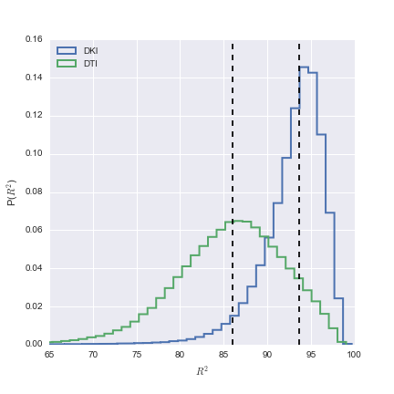

# Title title title

## Introduction

Diffusion MRI (dMRI) measurements provide detailed information about human brain
connectivity and microstructure *in vivo* [@rokem2017visual]. Understanding the
human brain will require concerted effort in the collection and analysis of
large collections of data, from large populations of participants. The Human
Connectome Project (HCP) has led the way for "brain observatories".  HCP is
measuring high-quality multi-modal MRI data from 1,200 individuals and making
these data publicly available [@VanEssen2012]. It has already made measurements
from approximately 900 subjects available through Amazon's Simple Storage
Service (S3). As additional observatories get off the ground, it is important
for the neuroinformatics community to converge on methods that can be used to
evaluate the models that we use to explain the data, and on methods to produce
and distribute derived data products from these datasets. Here, we present an
analysis of the data from the S900 (900 subjects) release of the HCP. We answer
a simple question: what model should we use to calculate basic and commonly used
statistics of water diffusion in the white matter? We use a cross-validation
accuracy criterion [@hastie2001] to evaluate the accuracy of two alternative
models of diffusion in the white matter [@Rokem2015PLoS]: the classic Diffusion
Tensor Model (DTM), model, and a slightly more complex Diffusion Kurtosis Model
(DKM). Importantly, these models both can be used to calculate the same basic
diffusion statistics: mean diffusivity (MD) and fractional anisotropy (FA), that
are often used to assess microstructural properties of the white matter. These
assessments of FA and MD correlate with individual differences [CITE], and are
associated with clinical conditions [CITE], suggesting that they are markers of
important biological functions of the tissue in the white matter, though there
is still some ambiguity about the precise biological interpretation of these
statistics [@rokem2017visual].

### What model should we use to explain the data?

Evaluating diffusion MRI models by cross-validation [@Rokem2015PLoS].

## Methods

### The Human Connectome Project dMRI data-set

We analyzed the S900 release of the human connectome Project

#### The Diffusion Tensor Model (DTM)

Approximates diffusion in every voxel as a Gaussian distribution
[@Basser1994-hg]

(@eq-dti)  $S(\theta, b) = S_0 e^{\theta^T \mathbf{Q} \theta}$

where $\theta$ is XXX and $b$ is XXX

#### The Diffusion Kurtosis Model (DTM)

DKM is an extension of DTM that accounts for non-Gaussian behavior in complex
tissue, with many barriers to the diffusion process (cell membranes,
myelin sheaths, etc.) [@Jensen2005-vr]

(@eq-dti-qform) $\mathbf{D} = \begin{pmatrix} \sigma_{xx} & \sigma_{xy} & \sigma_{xz} \\ \sigma_{yx} & \sigma_{yy} & \sigma_{yz} \\ \sigma_{zx} & \sigma_{zy} & \sigma_{zz} \\ \end{pmatrix}$

As seen in equation (@eq-dti) and in equation (@eq-dti-qform) XXX

(@eq-dki)  $S(\theta, b)=S_{0}e^{-bD(\theta)+\frac{1}{6}b^{2}D(\theta)^{2}K(\theta)}$

(@eq-md) $D(\theta)=\sum_{i=1}^{3}\sum_{j=1}^{3}\theta_{i}\theta_{j}Q_{ij}$

(@eq-mk) $K(\theta)=\frac{MD^{2}}{D(\theta)^{2}}\sum_{i=1}^{3}\sum_{j=1}^{3}\sum_{k=1}^{3} \sum_{l=1}^{3}\theta_{i}\theta_{j}\theta_{k}\theta_{l}W_{ijkl}$

## Results

(@fig-histogram) 

As you can see in Figure (@fig-histogram) XXX

## References
