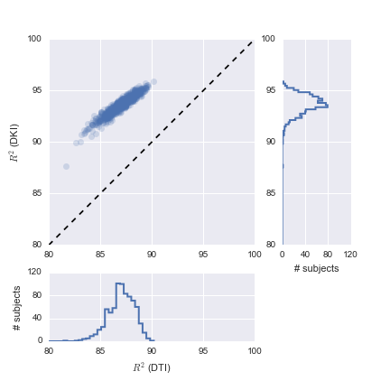
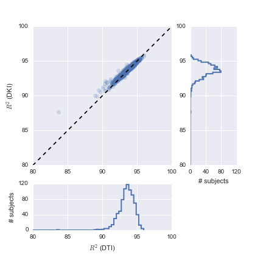

# Title title title

## Introduction

Understanding the human brain will require concerted effort in the acquisition
and analysis of collections of data from large cohorts of participants. The
Human Connectome Project (HCP) has led the way for such "brain observatories",
by measuring high-quality multi-modal MRI data from 1,200 individuals and making
these data publicly available [@VanEssen2012]. As additional observatories get
off the ground, it is important for the neuroinformatics community to converge
on methods that can be used to evaluate the models that we use to explain the
data, and on methods to produce and distribute derived data products from these
datasets. Here, we present an analysis of the diffusion MRI (dMRI) data from the
S900 release of the HCP. We answer a simple question: what model should we use
to calculate basic and commonly used statistics of water diffusion in the white
matter? Diffusion MRI (dMRI) measurements provide detailed information about
human brain connectivity and microstructure of brain white matter *in vivo*
[@rokem2017visual]. Many different models have been proposed to explain the
patterns of diffusion in every voxel in the white matter, and different models
may be appropriate for different data acquisitions [@Rokem2015PLoS]. We used a
cross-validation procedure [@james2013introduction, @Rokem2015PLoS] to evaluate
and compare two alternative models of diffusion in the white matter: the classic
Diffusion Tensor Model (DTM; [@Basser1994-hg]), which approximates diffusion as
a 3D Gaussian distribution, and the more complex Diffusion Kurtosis Model (DKM;
[@Jensen2005-vr]), which extends the DTM with non-Gaussian diffusion components.
Both of these models can be used to calculate the same basic diffusion
statistics -- mean diffusivity (MD) and fractional anisotropy (FA) -- that are
often used to assess microstructural properties of the white matter. These
assessments of FA and MD correlate with individual differences [CITE], and are
associated with clinical conditions [CITE], suggesting that they are markers of
important biological functions of the tissue in the white matter, though there
is still some ambiguity about the precise biological interpretation of these
statistics [@rokem2017visual]. Importantly, because of the differences between
the model parameterization, FA and MD that are derived from these models can
differ substantially. For example, Previous work [@Veraart2011-nq] has shown
that the DKM is more accurate in fitting data across a range of diffusion
weightings and that diffusion statistics calculated using DKM are less variable.
Consistent, other work also demonstrated advantages for the DKI model in
detecting biologically important characteristics in the diffusion signal
[@Cheung2009-ab, @Hui2008-ll]. However, this previous work was conducted in a
high-field (9.4T in [@Veraart2011-nq]) magnet, with small rodents (rats) as
participants, and a very large number of diffusion-weighted images (868). But
while it would be valuable to apply the lessons of these studies to the analysis
conducted on data from the HCP, because of these special experimental
conditions, it is not clear whether these results would generalize to the data
that was collected through the HCP. An empirical evaluation of model accuracy is
needed to infer model accuracy in a particular data-set.

## Methods

### The Human Connectome Project dMRI data-set

#### Data

We analyzed the S900 release of the human connectome Project provided through
the Amazon Web Services (AWS) Simple Storage Service (S3). A comprehensive
description of the scanning protocol has been previously published
[@Sotiropoulos2013-ww]. Briefly: dMRI scans conducted by the HCP are
pulsed-gradient spin echo measurements conducted in 270 diffusion-weighted
volumes with 90 directions in each of three b-values: 1,000, 2,000 and 3,000
$s/mm^2$. Data were acquired at a nominal resolution of 1.25 by 1.25 by 1.25
$mm^3$.

Preprocessed data for the S900 release were provided by the HCP through the
Amazon Web Services (AWS) Simple Storage Service (S3).

#### Models

We compared two models: The Diffusion Tensor Model (DTM) approximates the
diffusion in every voxel as a Gaussian distribution [@Basser1994-hg]. According
to the DTM, the signal should be well fit by:

(@eq-dti)  $S(\theta, b) = S_0 e^{\theta^T \mathbf{Q} \theta}$

where $\theta$ is the direction of the diffusion gradient applied in this
measurement and $b$ is the b-value: a scalar that summarizes the magnitude of
the gradient and the duration of its application and inter-gradient duration.

Q is a quadratic form:

(@eq-dti-qform) $\mathbf{D} = \begin{pmatrix} \sigma_{xx} & \sigma_{xy} & \sigma_{xz} \\ \sigma_{yx} & \sigma_{yy} & \sigma_{yz} \\ \sigma_{zx} & \sigma_{zy} & \sigma_{zz} \\ \end{pmatrix}$

and $sigma_ij$ are free parameters. Because of the directional symmetry of
diffusion, variance in $xy$ is identical to the variance in $yx$. Therefore,
there are only 6 free parameters in this model, for each voxel.

#### The Diffusion Kurtosis Model (DTM)

DKM is an extension of DTM that accounts for non-Gaussian behavior in complex
tissue, with many barriers to the diffusion process (cell membranes,
myelin sheaths, etc.) [@Jensen2005-vr]

As seen in equation (@eq-dti) and in equation (@eq-dti-qform) XXX

(@eq-dki)  $S(\theta, b)=S_{0}e^{-bD(\theta)+\frac{1}{6}b^{2}D(\theta)^{2}K(\theta)}$

(@eq-d) $D(\theta)=\sum_{i=1}^{3}\sum_{j=1}^{3}\theta_{i}\theta_{j}Q_{ij}$

(@eq-k) $K(\theta)=\frac{MD^{2}}{D(\theta)^{2}}\sum_{i=1}^{3}\sum_{j=1}^{3}\sum_{k=1}^{3} \sum_{l=1}^{3}\theta_{i}\theta_{j}\theta_{k}\theta_{l}W_{ijkl}$

$W$ is a three-way tensor (3 by 3 by 3 elements), but because of the symmetry,
there are only 15 in this model, for each voxel.

### Analysis and Software

To evaluate model accuacy, we conducted a 10-fold cross-validation procedure:
in each iteration, a random sub-set of 10% of the data (27 directions) was held
out. The model was fit to the remaining 90% of the data, and a prediction was
made based on the model fit in the held-out directions. This was repeated 10
times until each direction was predicted as a held out data point. The
coefficient of determination was then computed in each voxel between the
measured data and these predictions. Cross-validation predictions allow us to
compare the performance of the two models to each other directly, despite the
difference in the number of parameters, as cross-validation protects against
over-fitting due to an excess number of parameters.

To conduct these computations at the scale of the entire S900 data-set, we used
custom software written using the Spark open-source cluster computing framework
[@Zaharia2010-rp]. The software used implementations of the DKM and DTM
available in Dipy [@Garyfallidis2014FrontNeuroinf]. The software implementation
of the analysis is available on:
https://github.com/arokem/dki-accuracy-reliability

## Results

## References
